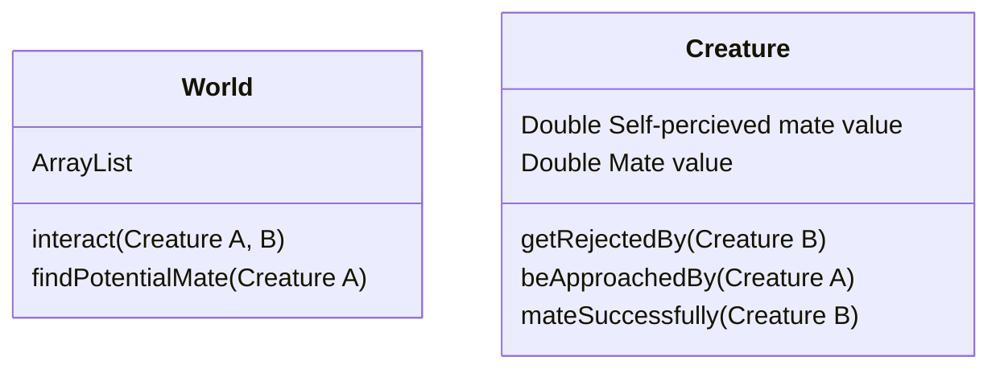

# Pond Of Eden
simulator of small creatures with simple behavior

### Scratch Pad
Simulating mating behavior
specifically how people of similar desireability pair up with eachother
The "Pairing Game"
Experiment where participants assigned a number they cannot see true to pair with other participants with numbers they can see and find ones as high as possible.

introduce some values such as mate value and self-percieved mate value.

every creature starts with a self percieved value of itself. It goes out to find mates; if it is rejected by a mate of higer value, his self values decreases; if it is approached by a mate of lower value, his self value also decreases. 

perhaps start the self value of every creature at max? since only a decrease mechanic is introduced currently. 

### OOP design diagram

### Desired features
- trace the behavior of a single creature and it's MV and SPMV vlues changes
- watch the population's overall difference between their MV and SPMV, theoretically, decrease

### Recources
- [JFreeChart](https://www.jfree.org/jfreechart/)
